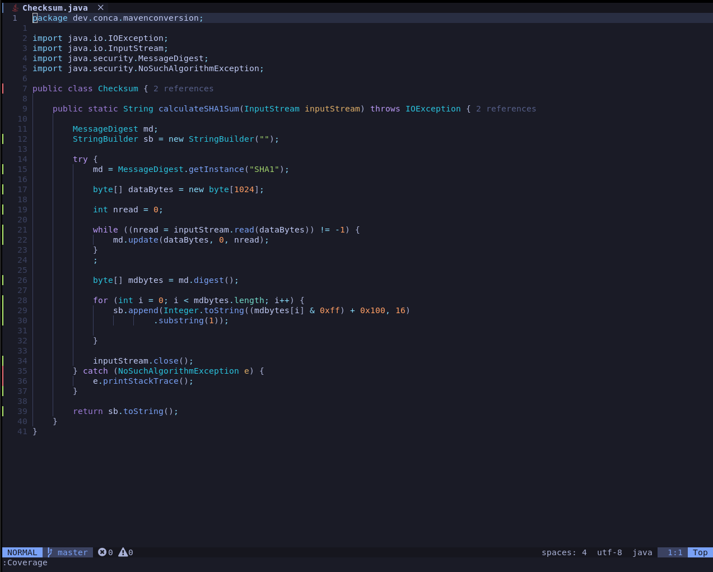
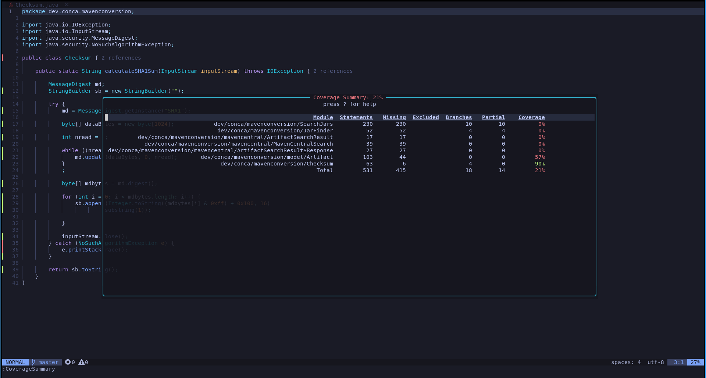

# nvim-coverage-java

Plugin to show test coverage data in java files.

Extension for [nvim-coverage](https://github.com/andythigpen/nvim-coverage) plugin.

*Note:* This plugin do not generate coverage information and depends on JaCoCo reports in XML
format containing coverage data.

## Install

This plugin requires nvim-coverage and also lua-xmlreader to parse XML reports.

Using Packer:
```lua
  use { "lluccia/nvim-coverage-java",
    requires = "andythigpen/nvim-coverage",
    rocks = "lua-xmlreader"
  }
```

## Generating coverage information

Using maven, add [JaCoCo plugin](https://www.jacoco.org/jacoco/trunk/doc/maven.html) in your `pom.xml` file:

```xml
    <build>
        </plugins>
            ...
            <plugin>
                <groupId>org.jacoco</groupId>
                <artifactId>jacoco-maven-plugin</artifactId>
                <version>0.8.9</version>
                <executions>
                    <execution>
                        <goals>
                            <goal>prepare-agent</goal>
                        </goals>
                    </execution>
                    <execution>
                        <id>report</id>
                        <phase>prepare-package</phase>
                        <goals>
                            <goal>report</goal>
                        </goals>
                    </execution>
                </executions>
            </plugin>
		</plugins>
	</build>
```

And run some tests:
```sh
# just unit tests
mvn test jacoco:report

# or including integration tests
mvn verify
```

## Verifing coverage information

Open a project java file in neovim and run:

- to load coverage data and show coverage signs in the current file.

```
:Coverage
```



- to show summary coverage data in files and project
```
:CoverageSummary
```




## Config

The plugin will search by default the JaCoCo coverage file in the following directory: `target/site/jacoco/jacoco.xml`

The path can be customized using the setup function with the following option:

```lua
require("coverage.languages.java").setup({coverage_file = "newpath/jacoco.xml"})
```

